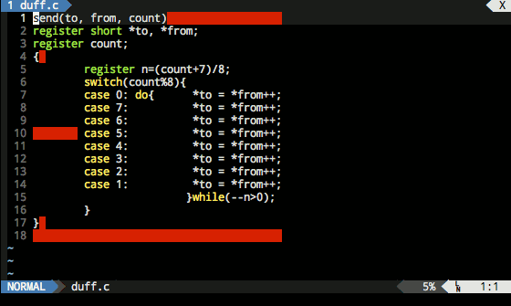

# whitespace.vim

whitespace.vim is a Vim plugin that finds and corrects common whitespace errors.

## Installation

This plugin is compatible with several popular plugin managers:

### Pathogen

    git clone git://github.com/sstallion/vim-whitespace.git ~/.vim/bundle/vim-whitespace

### Vundle

Add the following to your `.vimrc` and execute the `:PluginInstall` command:

    Plugin 'sstallion/vim-whitespace'

### NeoBundle

Add the following to your `.vimrc` and execute the `:NeoBundleInstall` command:

    NeoBundle 'sstallion/vim-whitespace'

### vim-plug

Add the following to your `.vimrc` and execute the `:PlugInstall` command:

    Plug 'sstallion/vim-whitespace'

## Configuration

whitespace.vim has a number of global variables that modify the default
behavior:

### `g:whitespace_autostrip`

Enables automatic whitespace correction when writing the current buffer.
Defaults to `0`.

### `g:whitespace_hidden`

Disables showing whitespace errors when reading a new buffer. Defaults to `0`.

### `g:whitespace_highlight`

Name of the highlight group used to display whitespace errors. Defaults to
`ExtraWhitespace`.

### `g:whitespace_ignore`

List of file types to ignore whitespace errors. Defaults to the empty list.

### `g:whitespace_ignore_tabs`

List of file types to ignore tab-related errors. Defaults to the empty list.

## Commands

### `:WhitespaceStrip`

Corrects whitespace errors, optionally accepting a range. By default the entire
buffer is corrected.

## Key Mappings

Key mappings may be overridden by assigning the corresponding `<Plug>` binding
to a different sequence in your `.vimrc`.

### `<Leader>w`

Toggles display of matched whitespace errors in normal mode. Mapped to
`<Plug>WhitespaceToggle`.

### `[w`

Jump to previous whitespace error in normal mode. Mapped to
`<Plug>WhitespacePrev`.

### `]w`

Jump to next whitespace error in normal mode. Mapped to `<Plug>WhitespaceNext`.

### `gS`

Corrects whitespace errors for the entire buffer in normal mode. Mapped to
`<Plug>WhitespaceStripBuffer`.

### `gs`

Corrects whitespace errors for the current line in normal mode or the
highlighted area in visual mode. Mapped to `<Plug>WhitespaceStripLine` and
`WhitespaceStripVisual`, respectively.

## FAQ

### Why do I see `Error detected while processing function ...Whitespace`?

Some color schemes do not define the `ExtraWhitespace` highlight group. The
easiest way to work around this issue is to link `ExtraWhitespace` to a
compatible group, or to modify the `g:whitespace_highlight` variable in your
`.vimrc`:

    " The ErrorMsg highlight group is usually good enough; this will be an
    " issue for colorschemes that do not provide a legible background color:
    highlight! link ExtraWhitespace ErrorMsg

### Why do I see whitespace errors when editing git commit messages?

This is usually seen when setting `'expandtab'` by default (git uses tabs in the
default commit message template). To prevent whitespace.vim from detecting mixed
tab errors, add the following to your `.vimrc`:

    let g:whitespace_ignore_tabs = [
        \ 'git',
        \ 'gitcommit',
        \ 'gitconfig',
        \ 'gitrebase',
        \ 'gitsendemail',
        \ ]

## Acknowledgement

Inspiration for this plugin was taken from the Vim Tips
[wiki](http://vim.wikia.com/wiki/Remove_unwanted_spaces).
